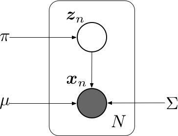

# 高斯混合模型的EM算法

## 混合高斯模型
高斯混合模型的概率分布可以写成多个高斯分布的线形叠加，即
$$
	p(\mathbf x) = \sum_{k=1}^{K}\pi_k\mathcal N(\mathbf x\ | \ \mathbf \mu_k, \mathbf \Sigma_k)
$$
引入一个$K$维的二值随机变量$\mathbf z$, 采用“$1$-of-$K$”编码，其中一个特定的元素$z_k$等于$1$，其余所有的元素都等于$0$。 于是$z_k$的值满足$z_k \in \{0, 1\}$且$\sum_k z_k = 1$，并且我们看到根据哪个元素非零，向量$\mathbf z$有$K$个可能的状态。$\mathbf z$的边缘概率分布可以根据混合系数$\pi_k$进行赋值，即
$$
	p(z_k=1) = \pi_k
$$
其中参数$\{\pi_k\}$必须满足
$$
	0 \leqslant \pi_k \leqslant 1
$$
以及
$$
	\sum_{k=1}^{K} \pi_k = 1
$$
由于$\mathbf z$使用了“$1$-of-$K$”编码，也可以将这个概率分布写成
$$
	p(\mathbf z) = \prod_{k=1}^{K}\pi_k^{z_k}
$$
对于$\mathbf z$给定的一个值， $\mathbf x$的条件概率分布是一个高斯分布
$$
	p(\mathbf x\ |\  z_k= 1) = \mathcal N (\mathbf x\ |\ \mathbf \mu_k, \mathbf \Sigma_k )
$$
类似的也可以写成
$$
	p(\mathbf x \ | \ \mathbf z) = \prod_{k=1}^{K} \mathcal N (\mathbf x \ |\ \mathbf \mu_k, \mathbf \Sigma_k ) ^ {z_k}
$$

$\mathbf x $的边缘概率分布可以通过将联合概率分布对所有可能的$\mathbf z$求和的方式得到，即
$$
	p(\mathbf x) = \sum_z p(\mathbf z)p(\mathbf x \ |\ \mathbf z) = \sum_{k=1}^{K}\pi_k \mathcal N(\mathbf x \ |\ \mathbf \mu_k, \mathbf \Sigma_k)
$$
于是我们找到了一个将隐变量$\mathbf z$显示写出的一个高斯混合分布等价公式。对联合概率分布$p(\mathbf x, \mathbf z)$而不是对$p(\mathbf x)$进行操作，会产生计算上极大的简化。

另一个有重要作用的量是给定$\mathbf x$的情况下，$\mathbf z$的后验概率$p(\mathbf z\ |\ \mathbf x)$。用$\gamma(z_k)$表示$p(z_k=1\ |\ \mathbf x)$，其值可由贝叶斯定理给出
$$
	\begin{align}
	\gamma(z_k) = p(z_k=1\ |\ \mathbf x) &= \frac{p(z_k=1)p(\mathbf x\ |\ z_k=1)}{\sum_{j=1}^{K}p(z_j=1)p(\mathbf x\ |\ z_j=1)} \\
	&= \frac{\pi_k p(\mathbf x\ |\ z_k=1)}{\sum_{j=1}^{K}\pi_j p(\mathbf x\ |\ z_j=1)} 
\end{align}
$$
可以将$\pi_k$看成是$z_k=1$的先验概率，将$\gamma(z_k)$看成是观测到$\mathbf x$之后，对应的后验概率。

假设我们有观测数据集$\{\mathbf x_1, \mathbf x_2, \ldots, \mathbf x_N\}$，我们希望使用混合高斯来对数据建模。可以将这个数据集标示为$N\times D$的矩阵$\mathbf X$，其中第$n$行为$\mathbf x_n^\top$。类似的，对应的隐变量被表示为一个$N\times K$的矩阵$\mathbf Z$，它的行为$\mathbf z_n^\top$，可以使用上图所示的图模型来表示独立同分布数据集的高斯混合模型。$\mathbf X$的对数似然函数为
$$
	\log p(\mathbf X\ |\ \mathbf \pi, \mathbf \mu, \mathbf \Sigma)=\sum_{n=1}^{N}\log\left\{ \sum_{k=1}^{K}\pi_k\mathcal N(\mathbf x_n\ |\ \mathbf \mu_k, \Sigma_k) \right\}
$$
最大化高斯混合模型的对数似然函数比单一的高斯分布的情形更加复杂。因为对$k$的求和出现在了对数内部；*如果令导数等于零，不会得到一个解析解*。
使用基于梯度的优化方法可以得到解，但现在考虑另一种可行方法，称为**EM算法**。

## EM 算法
期望最大化算法，也叫EM算法，是寻找潜在变量的概率模型的最大似然解的一种通用方法。考虑一个概率模型，其中所有的观测变量记作$\mathbf X$，所有隐含变量记作$\mathbf Z$。联合概率分布$p(\mathbf X, \mathbf Z\ |\ \mathbf \theta)$由一组参数$\mathbf \theta $控制，目标是最大化似然函数
$$
	p(\mathbf X\ |\ \mathbf \theta) = \sum_{\mathbf Z}p(\mathbf X, \mathbf Z | \mathbf \theta)
$$
这里，假设$\mathbf Z$是离散的。直接优化$p(\mathbf X\ |\ \mathbf\theta)$比较困难，但是最优化完整数据似然函数$p(\mathbf X, \mathbf Z\ |\ \mathbf \theta)$就容易得很多。接下来，引入一个定义在隐变量$\mathbf Z$上的分布$p(\mathbf Z)$。对任意$p(\mathbf Z)$，如下分解成立
$$
	\log p(\mathbf X\ |\ \mathbf\theta) = \mathcal L(q, \mathbf \theta) + \mathrm{KL}(q\ \|\ p)
$$
其中
$$
	\mathcal L(q, \mathbf\theta) = \sum_{\mathbf Z}q(\mathbf Z)\log\left\{ \frac{p(\mathbf X,\mathbf Z\ |\ \mathbf \theta)}{q(\mathbf Z)}\right\}
$$
$$
	\mathrm{KL}(p\ \|\ q) = -\sum_{\mathbf Z}q(\mathbf Z)\log\left\{\frac{p(\mathbf Z\ |\ \mathbf X, \mathbf\theta)}{q(\mathbf Z)}\right\}
$$
$\mathcal L(q, \mathbf\theta)$是概率分布$q(\mathbf Z)$的一个*范函*，并且是一个参数$\mathbf\theta$的函数。因为$\mathrm{KL}(p\ \|\ q) \geqslant 0$，当且仅当$q(\mathbf Z) = p(\mathbf Z\ |\ \mathbf X, \mathbf\theta)$时取得等号。因此，$\mathcal L(q, \mathbf\theta) \leqslant \log p(\mathbf X\ |\ \mathbf\theta)$，即$\mathcal L(q, \mathbf\theta)$是$\log p(\mathbf X\ |\ \mathbf\theta)$是的一个下界。

EM算法是一个两阶段迭代优化算法。

假设当前的参数$\mathbf\theta^{\mathrm{old}}$，在*E步骤*中，下界$\mathcal L(q, \mathbf\theta^{\mathrm{old}})$关于$q(\mathbf Z)$最大化，而$\mathbf\theta^{\mathrm{old}}$保持固定。当KL散度为零时，即得到了最大化的解。换句话说，最大值出现在$q(\mathbf Z)$与后验概率分布$p(\mathbf Z\ |\ \mathbf X, \mathbf\theta)$相等时，KL散度等于零，此时，下界等于最大似然函数。

在接下来的*M步骤*中，分布$q(\mathbf Z)$保持固定，下界$\mathcal L(q, \mathbf\theta)$关于$\mathbf\theta$最大化，得到了某个新的值$\mathbf\theta^{\mathrm{new}}$，这会使得下界$\mathcal L$增大。同时也会使得对数似然增大，因为概率分布$q$由旧的参数值确定，并且在*M步骤*保持固定，因此不会等于新的后验分布$p(\mathbf Z\ |\ \mathbf X,\mathbf\theta^{\mathrm{new}})$，从而KL散度非零；而且对数似然的增加量大于下界$\mathcal L(q, \mathbf\theta)$的增加量。在*E步骤*之后，下界的形式为
$$
\begin{align}
	\mathcal L(q, \mathbf\theta) &= \sum_{\mathbf Z}p(\mathbf Z\ |\ \mathbf X, \mathbf\theta^{\mathrm{old}})\log p(\mathbf X, \mathbf Z\ |\ \mathbf\theta) \\
	& \ \ \ \ - \sum_{\mathbf Z}p(\mathbf Z\ |\ \mathbf X,\mathbf\theta^{\mathrm{old}})\log p(\mathbf Z\ |\ \mathbf X, \mathbf\theta^{\mathrm{old}}) \notag \\
	&= \mathcal Q(\mathbf\theta, \mathbf\theta^{\mathrm{old}}) + \text{常数}
\end{align}
$$

其中常数是$q$的熵，与$\mathbf \theta$无关。从而，在*M步骤*中，最大化的量是**完整数据对数似然函数的期望**。完整的EM算法如下所示

**Algorithm1: 用于含有隐变量最大似然函数参数估计的EM算法**

* 选择参数的初始值 $\mathbf\theta^{(t)}, t = 0$
* **REPEAT**:
	* *E步骤*:  计算$p(\mathbf Z\ |\ \mathbf X, \mathbf\theta^{(t)})$
	* *M步骤*:  计算$\mathbf\theta^{(t+1)}$，由下式给出
$$
	\mathbf \theta^{(t+1)} = \arg\max_{\mathbf \theta}\mathcal Q (\mathbf\theta, \mathbf\theta^{(t)})
$$
其中
$$
	\mathcal Q (\mathbf\theta, \mathbf\theta^{(t)}) = \sum_{\mathbf Z}p(\mathbf Z\ |\ \mathbf X, \mathbf \theta^{(t)}) \log p(\mathbf X, \mathbf Z\ |\ \mathbf\theta)
$$
* **UNTIL**: 对数似然函数收敛或者参数值收敛

## 高斯混合模型的EM算法

现在考虑将EM算法的隐变量观点用于一个具体的例子，即高斯混合模型。我们的目标是最大化对数似然函数$\log p(\mathbf X\ |\ \mathbf \pi, \mathbf \mu, \mathbf \Sigma)$这是使用观测数据集$\mathbf X$计算的。这种情况比单一的高斯困难，因为求和出现在了对数运算内部。假设除了观测数据集$\mathbf X$，还有对应的离散变量$\mathbf Z$。现在考虑对完整数据$\{\mathbf X, \mathbf Z\}$最大化。完整数据集的似然函数的形式为
$$
	p(\mathbf X, \mathbf Z\ |\ \mathbf \mu, \mathbf \Sigma, \mathbf \pi) = \prod_{n=1}^{N}\prod_{k=1}^{K}\pi_k^{z_{nk}}\mathcal N(\mathbf x_n\ |\ \mathbf\mu_k, \mathbf\Sigma_k)^{z_{nk}}
$$
其中$z_{nk}$表示$\mathbf z_n$的第$k$个分量。取对数，有
$$
	\log p(\mathbf X, \mathbf Z\ |\ \mathbf\mu, \mathbf\Sigma, \mathbf\pi) = \sum_{n=1}^{N}\sum_{k=1}^{K}z_{nk}\left\{ \log\pi_k+\log\mathcal N(\mathbf x_n\ |\ \mathbf\mu_k, \mathbf\Sigma_k) \right\}
$$
现在将完全数据的对数似然对$\mathbf Z$的后验概率分布求期望。后验概率分布为
$$
	p(\mathbf Z\ |\ \mathbf X, \mathbf \mu, \mathbf\Sigma, \mathbf\pi) = \prod_{n=1}^{N}p(\mathbf z_n\ |\ \mathbf x_n, \mathbf \mu,\mathbf\Sigma, \mathbf\pi)
$$
在这个分布下, $z_{nk}$的期望为
$$
\begin{align}
	\mathbb E_{\mathbf Z}[z_{nk}] & = \sum_{\mathbf z_1}\cdots\sum_{\mathbf z_N} z_{nk}p(\mathbf Z\ |\ \mathbf X, \mathbf \theta) \\
	& = \sum_{\mathbf z_1}p(\mathbf z_1\ |\ \mathbf x_n, \mathbf\theta) \cdots \sum_{\mathbf z_n}z_{nk}p(\mathbf z_n\ |\ \mathbf x_n, \mathbf\theta) \cdots \sum_{\mathbf z_N}p(\mathbf z_N\ |\ \mathbf x_n, \mathbf\theta)\\
	& = \sum_{\mathbf z_n}z_{nk}p(\mathbf z_n\ |\ \mathbf x_n, \mathbf\theta) \\
	& = p(z_{nk} = 1\ |\ \mathbf x_n, \mathbf\theta)
\end{align}
$$
其中$\mathbf\theta = (\mathbf\mu, \mathbf\Sigma, \mathbf\pi)$。利用贝叶斯公式，有
$$
\begin{align}
	p(z_{nk}=1\ |\ \mathbf x_n, \mathbf\theta) &= \frac{p(z_{nk}=1)p(\mathbf x_n\ |\ z_{nk}=1)}{\sum_{j=1}^{K}p(z_{nj}=1)p(\mathbf x_n \ |\ z_{nj}=1)}\\
	& = \frac{\pi_k \mathcal N(\mathbf x_n\ |\ \mathbf\mu_k, \mathbf\Sigma_k)}{\sum_{j=1}^{K}\pi_j\mathcal N(\mathbf x_n\ |\ \mathbf\mu_j, \mathbf\Sigma_j)}\\
	& \equiv \gamma(z_{nk})
\end{align}
$$
$\gamma(z_{nk})$被定义为数据点$\mathbf x_n$种含有来自于第$k$个高斯分布的“成分”。
于是，完整数据的对数似然的期望值为
$$
	\mathbb E_{\mathbf Z}\left[\log p(\mathbf X,\mathbf Z\ |\ \mathbf\mu,\mathbf\Sigma,\mathbf \pi) \right] = \sum_{n=1}^{N}\sum_{k=1}^K\gamma(z_{nk})\left\{\log\pi_k + \log\mathcal N(\mathbf x_n\ |\ \mathbf\mu_k, \mathbf\Sigma_k)\right\}
$$
我们使用旧的参数$\left\{ \mathbf\mu^{\mathrm{old}}, \mathbf\Sigma^{\mathrm{old}}, \mathbf\pi^{\mathrm{old}} \right\}$计算$\gamma(z_{nk})$(*E步骤*)；之后保持$\gamma(z_{nk})$不变，关于$\mathbf \mu_k$,$ \mathbf\Sigma_k$, $\pi_k$最大化(*M步骤*)，得到新的$\left\{ \mathbf\mu^{\mathrm{new}}, \mathbf\Sigma^{\mathrm{new}}, \mathbf\pi^{\mathrm{new}} \right\}$。

在进行M步骤之前，需要先参考一些关于矩阵求导数的运算，具体如下
$$
	\sum_{i=1}^N\mathbf x_i^\top\mathbf S\mathbf x_i = \mathrm{Tr}(\mathbf S\sum_{i=1}^N\mathbf x_i\mathbf x_i^\top)
$$
$$
	\frac{\partial\mathrm{Tr}(\mathbf A\mathbf B)}{\partial\mathbf A} = \mathbf B^\top
$$
$$
	\frac{\partial}{\partial\mathbf A}\log|\mathbf A| = (\mathbf A^{-1})^\top 
$$

现在关于$\pi_k$最大化。注意到由于$\sum_{k=1}^{K}\pi_k=1$的限制，可以使用拉格朗日乘数法进行优化。构造拉格朗日函数为
$$
	\mathcal L(\mathbf\pi, \lambda) = \sum_{n=1}^N\sum_{k=1}^K\gamma(z_{nk})\log \pi_k+ \lambda(1-\sum_{k=1}^K\pi_k)
$$
对$\pi_k$求导，并令其等于零，有
$$
	\frac{1}{\lambda}\sum_{n=1}^N\gamma(z_{nk}) = \pi_k,\ \ \ k=1, \ldots, N
$$
又由$\sum_{k=1}^{K}\pi_k=1$，得出$\lambda=N$，所以更新后的$\pi_k$为
$$
	\pi_k^{\mathrm{new}} = \frac{N_k}{N}
$$
其中$N_k = \sum_{n=1}^N\gamma(z_{nk})$。

关于$\mathbf\mu_k$最大化。注意到，完整数据的对数似然中包含$\mathbf\mu_k$的项是
$$
\begin{align}
	& \sum_{n=1}^{N}\gamma(z_{nk})\log\mathcal N(\mathbf x_n\ |\ \mathbf\mu_k, \mathbf\Sigma_k) \\
	& = \sum_{n=1}^{N}\gamma(z_{nk})\left\{-\frac{D}{2}\log(2\pi) + \frac{1}{2}\log|\mathbf\Sigma_k^{-1}| -\frac{1}{2} (\mathbf x_n-\mathbf \mu_k)^\top\mathbf\Sigma_k^{-1}\mathbf(\mathbf x_k-\mathbf\mu_k)\right\}
\end{align}
$$
对$\mathbf\mu_k$求导，并令其等于零，得
$$
	\sum_{n=1}^N\gamma(z_{nk})\mathbf\Sigma_k^{-1}(\mathbf x_n-\mathbf\mu_k) = 0
$$
化简
$$
	\sum_{n=1}^N\gamma(z_{nk})\mathbf\Sigma_k^{-1}\mathbf x_n  = \sum_{n=1}^N\gamma(z_{nk})\mathbf\Sigma_k^{-1}\mathbf u_k
$$
两边同乘$\mathbf\Sigma_k$，得
$$
	\sum_{n=1}^N\gamma(z_{nk})\mathbf x_n = \sum_{n=1}^N\gamma(z_{nk})\mathbf \mu_k = N_k \mathbf\mu_k
$$
所以，得到新的$\mathbf \mu_k^{\mathrm{new}}$为
$$
	\mathbf\mu_k^{\mathrm{new}} = \frac{1}{N_k}\sum_{n=1}^N\gamma(z_{nk})\mathbf x_n
$$

关于$\mathbf\Sigma_k$最大化。将完整数据对数似然关于$\mathbf Z$后验概率的期望关于$\mathbf\Sigma_k^{-1}$求导，并令其导数等于零。具体过程如下
$$
\begin{align}
	\mathbf\Sigma_k & = \frac{1}{N_k}\frac{\partial}{\partial \mathbf\Sigma_k^{-1}}\mathrm{Tr}\left(\mathbf\Sigma_k^{-1}\sum_{n=1}^N\gamma(z_{nk})(\mathbf x_n-\mathbf \mu_k)(\mathbf x_n-\mathbf\mu_k)^\top\right)\\
	& = \frac{1}{N_k}\sum_{n=1}^N\gamma(z_{nk})(\mathbf x_n-\mathbf \mu_k)(\mathbf x_n-\mathbf\mu_k)^\top
\end{align}
$$
所以，新的$\mathbf\Sigma_k^{\mathrm{new}} = \frac{1}{N_k}\sum_{n=1}^N\gamma(z_{nk})(\mathbf x_n-\mathbf \mu_k^{\mathrm{new}})(\mathbf x_n-\mathbf\mu_k^{\mathrm{new}})^\top$。

总结一下，高斯混合分布的参数估计如下

* 初始化均值$\mathbf \mu_k$，协方差$\mathbf \Sigma_k$和混合系数$\mathbf\pi_k$，计算对数似然的初始值
* **E步骤** 使用当前参数，计算每个数据点的成分$\gamma(z_{nk})$
	$$
		\gamma(z_{nk}) = \frac{\pi_k\mathcal N(\mathbf x_n\ |\ \mathbf\mu_k,\mathbf\Sigma_k)}{\sum_{j=1}^K\pi_j\mathcal N(\mathbf x_n\ |\ \mathbf\mu_j,\mathbf\Sigma_j)}
	$$
* **M步骤** 使用当前的$\gamma(z_{nk})$重新估计参数。
$$
		\mathbf\mu_k^{new} = \frac{1}{N_k}\sum_{n=1}^N\gamma(z_{nk})\mathbf x_n
$$	
$$
		\mathbf\Sigma_k^{\mathrm{new}} = \frac{1}{N_k}\sum_{n=1}^N\gamma(z_{nk})(\mathbf x_n-\mathbf \mu_k^{\mathrm{new}})(\mathbf x_n-\mathbf\mu_k^{\mathrm{new}})^\top
$$
$$
		\pi_k^{\mathrm{new}} = \frac{N_k}{N}
$$
	其中
$$
		N_k = \sum_{n=1}^N\gamma(z_{nk})
$$
* 计算对数似然函数
$$
		\log p(\mathbf X\ |\ \mathbf \pi, \mathbf \mu, \mathbf \Sigma)=\sum_{n=1}^{N}\log\left\{ \sum_{k=1}^{K}\pi_k\mathcal N(\mathbf x_n\ |\ \mathbf \mu_k, \Sigma_k) \right\}
$$
* 检查参数或者对数似然函数的收敛性。若没有满足收敛条件，返回**E步骤**。

## 实验
使用*pytho*模拟混合高斯分布的参数估计。混合高斯分布也可以用来聚类，与K-Means相比，可以实现*软聚类*，可以计算出给定数据点$\mathbf x_n$属于第$k$个聚类的成分：$\gamma(z_{nk})$