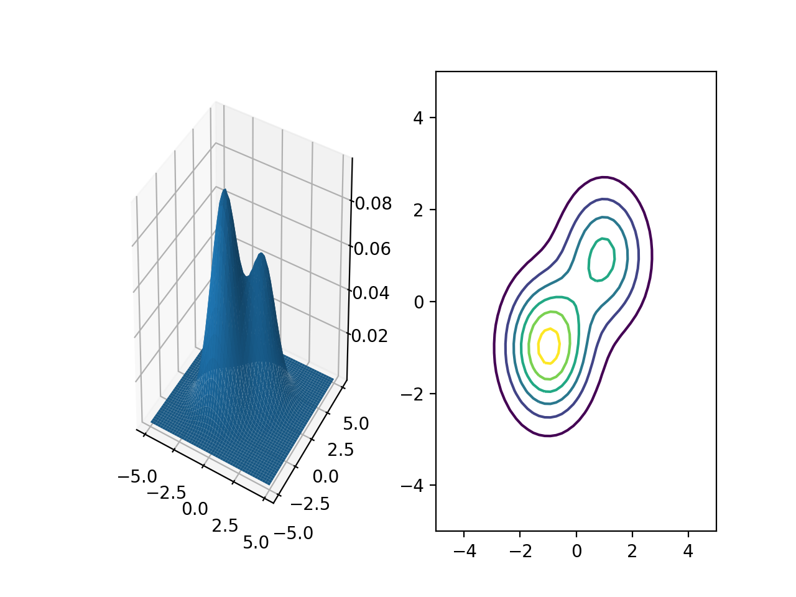

# 绘制混合高斯模型

## 1. 多维高斯分布
多维高斯分布的形式如下
$$
\label{eq:multi-gaussion}
	\mathcal N (\mathbf x\ |\ \mathbf\mu, \mathbf\Sigma) = \frac{1}{ (2\pi)^{\frac{D}{2}}\det(\mathbf\Sigma)^{\frac{1}{2}} }\exp\left\{ -\frac{1}{2}(\mathbf x-\mathbf\mu)^\top \mathbf\Sigma^{-1}(\mathbf x-\mathbf\mu)\right\}
$$

其中$D$表示数据的维度， $\mathbf\mu$是分布的均值，$\mathbf\Sigma$为分布的协方差矩阵。

## 2. 高斯分布的混合
可以使用多个高斯分布的混合来模拟一个复杂的分布。为了保证概率的归一化，可以给每个高斯分布分配一个权重，记作$\mathbf\pi$, $\mathbf\pi = (\pi_1, \ldots, \pi_K)$， $K$代表混合分布中高斯分布的个数。混合高斯分布的形式为
$$
	p(\mathbf x\ |\ \mathbf \mu, \mathbf\Sigma, \mathbf\pi) = \sum_{k=1}^K\pi_k\mathcal N(\mathbf x\ |\ \mathbf\mu_k, \mathbf\Sigma_k)
$$
其中
$$
	\sum_{k=1}^K\pi_k = 1
$$

## 3. 绘制混合高斯分布模型
#### 导入必要的python库
```python
import matplotlib.pyplot as plt
from mpl_toolkits.mplot3d import Axes3D
import numpy as np 
from numpy.linalg import inv, det
```
### 定义多维高斯分布模型
```python
# 多维高斯分布
def gaussion(x, mu, Sigma):
    dim = len(x)
    constant = (2*np.pi)**(-dim/2) * det(Sigma)** (-0.5)
    return constant*np.exp(-0.5*(x-mu).dot(inv(Sigma)).dot(x-mu))
```
### 定义混合高斯模型
```python
# 混合高斯模型
def gaussion_mixture(x, Pi, mu, Sigma):
    z = 0
    for idx in range(len(Pi)):
    	z += Pi[idx] * gaussion(x, mu[idx], Sigma[idx])
    return z
```

### 设定混合高斯的参数(权重$\mathbf\pi$，均值$\mathbf\mu$，协方差矩阵$\mathbf\Sigma$)
```python
Pi = [ 0.4, 0.6 ]
mu = [ np.array([1,1]), np.array([-1,-1]) ]
Sigma = [ np.array([[1, 0], [0, 1]]), np.array([[1, 0], [0, 1]]) ]
```
### 计算坐标范围内各个点的混合高斯概率
```python
x = np.linspace(-5, 5, 50)
y = np.linspace(-5, 5, 50)
x, y = np.meshgrid(x, y)

X = np.array([x.ravel(), y.ravel()]).T
z = [ gaussion_mixture(x, Pi, mu, Sigma) for x in X]
z = np.array(z).reshape(x.shape)
```
### 绘制混合高斯模型
```python
fig = plt.figure()
# 绘制3d图形
ax1 = fig.add_subplot(1, 2, 1, projection='3d')
ax1.plot_surface(x, y, z)
# 绘制等高线
ax2 = fig.add_subplot(1, 2, 2)
ax2.contour(x, y, z)

plt.show()
```

### 绘制效果
