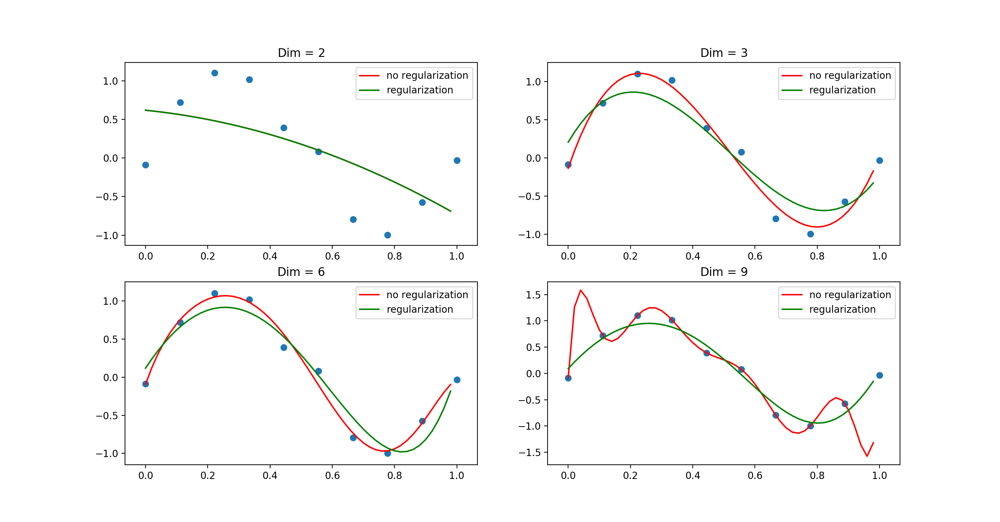

# 多项式曲线拟合
本文参照PRML第一章与第三章，实作验证了多项式曲线拟合的例子

## 线性基函数模型
现在假设一个训练集，这个训练集由$\mathbf x$的$N$的观测组成，写作$\mathbf x = (x_1, \ldots, x_N)^\top$，与之对应的$\mathbf t$的观测值记作$\mathbf t = (t_1, \ldots, t_N)^\top$。现在，从$[0,1]$之间均匀选取$N$个$x_n$，目标数据$\mathbf t$的获取方式是：首先计算函数$\sin(2\pi x)$的对应值，然后给得到的每个数据点增加一个小的满足高斯分布的随机噪声，从而得到对应的$t_n$值，即
$$
	t_n = \sin(2\pi x_n) + \varepsilon
$$
其中$\varepsilon$采样自$\mathcal N(\varepsilon\ |\ 0, \sigma^2)$。

我们的目标是利用这个训练集预测对于新的输入变量$x$的目标变量值$t$。这本质上是一个困难的问题，因为我们不得不从有限的数据生成对应的模型。而且，观测到的数据被噪声干扰，因此对于一个给定的$x$，合适的$t$值具有不确定性。但是现在，我们可以使用一种不太正式的，相当简单的方式来进行曲线的拟合。我们考虑如下的线性模型
$$
	y(\mathbf x, \mathbf \omega) = \omega_0 + \sum_{j=1}^{M-1}\omega_j\phi_j(\mathbf x)
$$
其中$\phi_j(\mathbf x)$被称为基函数，且这个模型中的参数总数为$M$。

在本例中，基函数$\phi_j(\mathbf x)$设为
$$
	\phi_j(\mathbf x) = x^j
$$
如果我们设定$\phi_0(\mathbf x)=1$，则可将上式模型写作
$$
   y(\mathbf x, \mathbf \omega) = \sum_{j=0}^{M-1}\omega_j\phi_j(\mathbf x) = \mathbf \omega^\top\phi(\mathbf x)
$$
其中$\mathbf \omega=(\omega_0, \ldots, \omega_{M-1})^\top$且$\mathbf\phi=(\phi_0, \ldots, \phi_{M-1})^\top$

我们可以使用非线性的基函数，使得$y(\mathbf x, \mathbf\omega)$为输入向量$\mathbf x$的一个非线性函数，但是这样的情况依然被称作是线性函数，因为这个函数是$\mathbf \omega$的线性函数。

## 模型的参数估计
### 最小平方误差估计
系数$\mathbf \omega$的估计可以通过最小化误差函数来获得。一个简单的广泛应用的与差函数是每个数据点$x_n$的预测值$y(x_n, \mathbf\omega)$与目标值$t_n$相差的平方和
$$
\mathbf E(\omega)=\frac{1}{2}\sum_{n=1}^N\left\{ y(x_n, \mathbf\omega) - t_n \right\}^2
$$
其中，$\frac{1}{2}$是为了计算方便。现在我们要选取使得$\mathbf E(\mathbf\omega) $最小的$\mathbf\omega$值，因为，若所有数据均预测正确，那么误差值就为零。即
$$
	\mathbf\omega^* = \arg\min_{\mathbf\omega}\mathbf E(\mathbf\omega)
$$

由于误差函数是$\mathbf\omega$的二次函数，所以关于$\mathbf\omega$的导数是线性函数，令其等于零，只有一解，也即误差函数的最小值有一个唯一解。

现在将上一节所述模型代入误差函数求解，即
$$
	\mathbf E(\mathbf\omega)=\frac{1}{2}\sum_{n=1}^N\left\{ t_n-\omega^\top\mathbf\phi(x_n) \right\}^2
$$
对其关于$\mathbf\omega$求导， 得
$$
	\nabla_{\mathbf\omega}\mathbf E(\mathbf\omega) = \sum_{n=1}^N\left\{ t_n-\mathbf\omega^\top\mathbf\phi(x_n) \right\}\mathbf\phi(x_n)^\top
$$
令其等于零，可得
$$
	0 = \sum_{n=1}^{N}t_n\mathbf\phi(x_n)^\top - \mathbf\omega^\top\left( \sum_{n=1}^{N}\mathbf\phi(x_n)\phi(x_n)^\top \right)
$$
求解$\mathbf\omega$，有
$$
\mathbf\omega^* = (\mathbf\Phi^\top\mathbf\Phi)^{-1}\mathbf\Phi^\top\mathbf t
$$
这里$\mathbf\Phi$是一个$N\times M$的矩阵，其元素$\Phi_{nj} = \phi_j(x_n)$，即
$$
\mathbf\Phi = \left(
	\begin{matrix}
		\phi_0(x_1) & \phi_1(x_1) &\cdots & \phi_{M-1}(x_1) \\
		\phi_0(x_2) & \phi_1(x_2) &\cdots & \phi_{M-1}(x_2) \\
		\vdots & \vdots & \ddots & \vdots \\
		\phi_0(x_N) & \phi_1(x_N) &\cdots & \phi_{M-1}(x_N) \\
	\end{matrix}
	\right)
$$
式中
$$
	(\mathbf\Phi^\top\mathbf\Phi)^{-1}\mathbf\Phi
$$
被定义为$\mathbf\Phi$的MP伪逆。

之后预测模型可以写作
$$
y(\mathbf x, \mathbf \omega) = \mathbf \omega^{*\top}\phi(\mathbf x)
$$

### 最大似然估计
**最小平方误差的解可以看成高斯噪声模型假设下的最大似然解。**

与一开始一样，假设目标变量$t$由确定的函数$y(\mathbf x, \mathbf\omega)$给出，这个函数被附加了一个高斯噪声，即
$$
	t = \sin(2\pi x) + \varepsilon
$$
其中$\varepsilon$是一个零均值，精度(方差的倒数)为$\beta=\frac{1}{\sigma^2}$的高斯随机变量。因此，有
$$
	p(t\ |\ x, \omega, \beta) = \mathcal N(t\ |\ y(\mathbf x, \mathbf\omega), \beta^{-1})
$$
考虑现在有给定的输入数据集$\mathbf X = \{x_1, \ldots, x_N\}$，对应的目标值为$\mathbf t = \{t_1, \ldots, t_N\}$。那么观测数据的似然函数为
$$
	p(\mathbf t\ |\ \mathbf X, \mathbf \omega, \beta) = \prod_{n=1}^N\mathcal N(t_n\ |\ \mathbf\omega^\top\mathbf\phi(x_n), \beta^{-1})
$$
取对数，并且使用一元高斯分布的标准形式，有
$$
	\begin{align}
	\log p(\mathbf t\ |\ \mathbf\omega, \beta^{-1}) &= \sum_{n=1}^{N}\log\mathcal N(t_n\ |\ \mathbf\omega^\top\mathbf\phi(x_n), \beta^{-1}) \notag \\
	&= \frac{N}{2}\log\beta - \frac{N}{2}\log(2\pi)-\beta E_D(\mathbf \omega)
\end{align}
$$
其中平方和误差函数被定义为
$$
	E_D(\mathbf \omega) = \frac{1}{2}\sum_{n=1}^{N}\{t_n-\mathbf\omega^\top\mathbf\phi(x_n) \}^2
$$
写出了似然函数，我们可以使用最大似然函数的方法确定$\mathbf \omega$。

在这里，关于$\mathbf\omega$求最大值，与之前求最小平方误差等价。求解$\mathbf\omega$有
$$
\mathbf\omega_{\mathrm ML} = (\mathbf\Phi^\top\mathbf\Phi)^{-1}\mathbf\Phi^\top\mathbf t
$$

## 正则化
可以通过给误差函数添加正则化项来控制过拟合，因此需要最小化的误差函数为
$$
	\mathbf E(\mathbf\omega) +\lambda \mathbf E_\omega(\mathbf\omega)
$$
其中$\lambda$是正则化系数。正则化项一个简单的形式是$\ell_2$正则
$$
\mathbf E_\omega(\omega) = \frac{1}{2}\mathbf\omega^\top\mathbf\omega
$$
考虑$\ell_2$正则化，那么整个误差函数就变为
$$
\frac{1}{2}\sum_{n=1}^N\left\{ t_n-\mathbf\omega^\top \mathbf\phi(x_n) \right\}^2+\frac{\lambda}{2}\mathbf\omega^\top\mathbf\omega
$$
令其关于$\mathbf\omega$的导数等于零，可得
$$
\mathbf\omega = (\lambda\mathbf I+\mathbf\Phi^\top\mathbf\Phi)^{-1}\mathbf\Phi^\top\mathbf t
$$

## 实验
使用 *Python* 模拟实验。

导入必要的数据包

```python
import matplotlib.pyplot as plt 
import numpy as np 
from numpy.linalg import inv
from functools import partial
```
生成具有高斯噪声的目标数据值$t_n$

```python
RANGE = [0, 1]
X = np.linspace(*RANGE, 10)
target = np.sin(2*np.pi*X) + np.random.normal(0, 0.2, len(X))
```

定义$\phi(x_n)$与$\mathbf\Phi$

```python
def phi(x, m):
    _phi = [ 1 ]
    for i in range(m):
        _phi.append(x**(i+1))
    return _phi

def Phi(X, m):
    _Phi = [ ]
    for x in X:
        _Phi.append(phi(x, m))
    return np.array(_Phi)
```

定义预测函数，以及预测模型的绘制函数

```python
def predict(x, omega):
    return  omega.dot(phi(x, len(omega)-1))
    
def plot_predict(func, range, label='', resolution=0.02, color='red'):
    _x = np.arange(range[0], range[1], 0.02)
    _y = [ func(x) for x in _x ]
    plt.plot(_x, _y, color=color, label=label)
```

对比各种参数个数的模型，以及正则化模型之间的对比

```python
for idx, dim in enumerate([2, 3, 6, 9]):
    # 计算模型参数
    _Phi = Phi(X, dim)
    omega = inv(_Phi.T.dot(_Phi)).dot(_Phi.T).dot(target)
    ## 正则化
    lambda_ = 1e-3
    omega_r = inv(lambda_*np.eye(dim+1) + _Phi.T.dot(_Phi)).dot(_Phi.T).dot(target)

    # 预测函数
    predict = partial(predict, omega=omega)
    predict_r = partial(predict, omega=omega_r)

    # 绘制图像
    ax = plt.subplot(2, 2, idx+1)
    plot_predict(predict, RANGE, label='no regularization', color='red')
    plot_predict(predict_r, RANGE, label='regularization', color='green')
    plt.scatter(X, target)
    plt.title('Dim = $%d$' % dim)
    plt.legend()
    
plt.show()
```

## 实验结果



